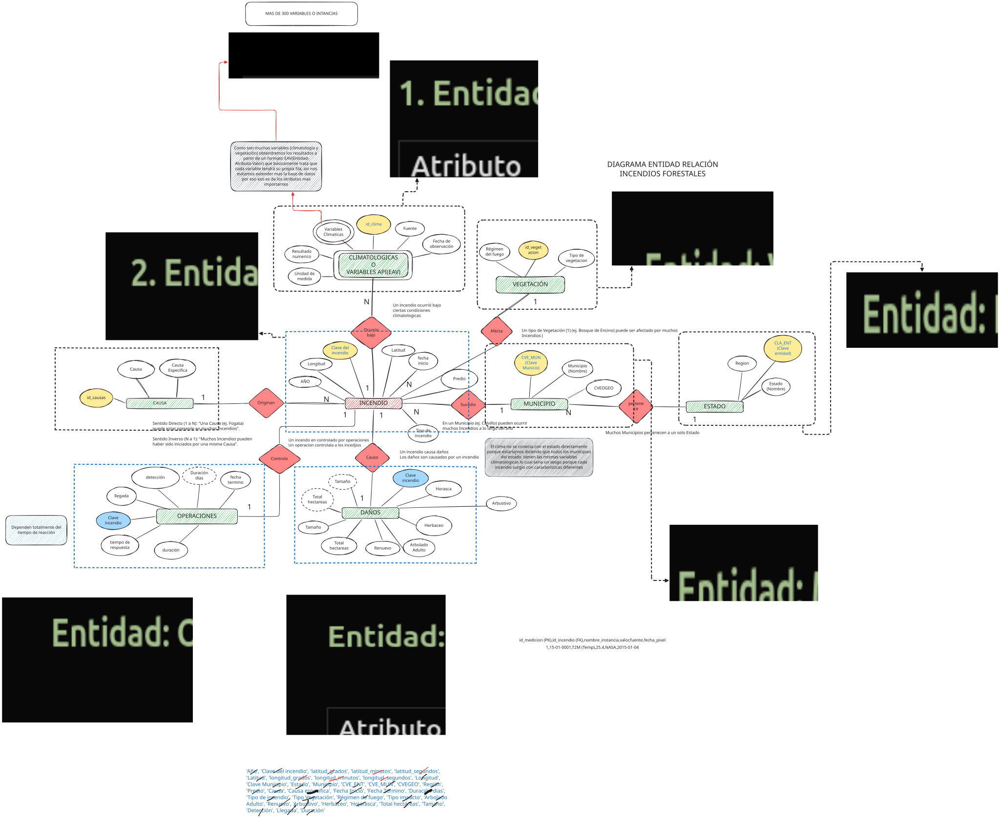

# 🔥 Análisis de Incendios Forestales en Tlaxcala

Proyecto de Ciencia de Datos enfocado en la predicción y análisis de incendios forestales utilizando datos de la NASA y CONAFOR.

##  Arquitectura de Datos
Este es el modelo Entidad-Relación que utilizaremos para estructurar nuestro Cubo OLAP:

## 📁 Estructura del Proyecto
- **01_OBTENER:** Scripts para recolectar datos de la API de la NASA.
- **02_LIMPIAR:** Procesamiento y limpieza de variables climáticas.
- **03_MODELAR:** Construcción del Cubo OLAP (SQLite).
- **04_INTERPRETAR:** Visualización y conclusiones.